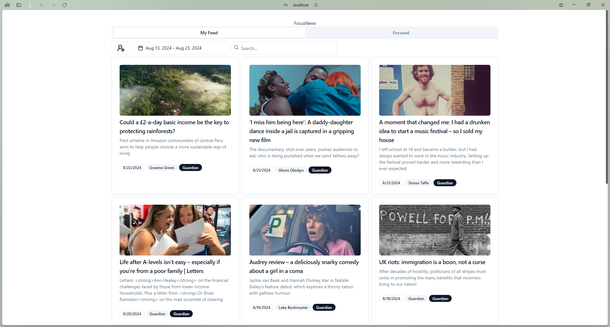
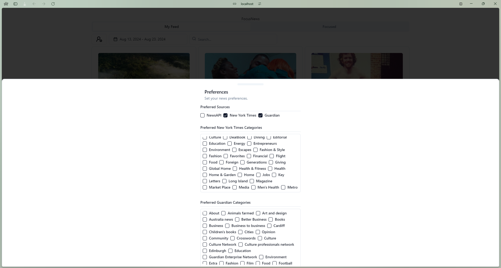

# Focus News

## Description
Focus News is a web application that fetches and displays news articles based on user preferences. It uses React, TypeScript, and Vite for the frontend, and Zustand for state management.

## Features


- Fetch news articles from multiple APIs.
- Display news articles based on user preferences.
- Allow users to select news categories.
- Allow users to select news sources.
- Allow users to search for news articles.
- Allow users to filter news articles by date.
- Works on mobile and desktop devices.

## Installation

1. Clone the repository:
    ```sh
    git clone https://github.com/agomesp/focusnews.git
    cd focusnews
    ```

2. Install dependencies:
    ```sh
    npm install
    ```

## Running the Application

To run the application locally:
    ```sh
    npm start
    ```
This will start the Vite development server.

## Docker
To build and run the application using Docker:

1. Build the Docker image:  
    ```sh
    docker build -t focusnews .
    ```

2. Run the Docker container:
    ```sh
    docker run -p 3000:3000 focusnews
    ```

## Scripts
- dev: Start the Vite development server.
- build: Build the application.
- lint: Run ESLint.
- preview: Preview the built application.
- start: Start the Vite development server.

## Technologies
- React: A JavaScript library for building user interfaces.
- TypeScript: A typed superset of JavaScript.
- Vite: A build tool that provides a faster and leaner development experience.
- Zustand: A small, fast, and scalable state-management solution.
- React Query: A library for fetching, caching, and updating asynchronous data in React.
- Docker: A platform for developing, shipping, and running applications in containers.
- Tailwind CSS: A utility-first CSS framework for rapid UI development.
- shadcn: A collection of accessible and customizable UI components built with Tailwind CSS.
